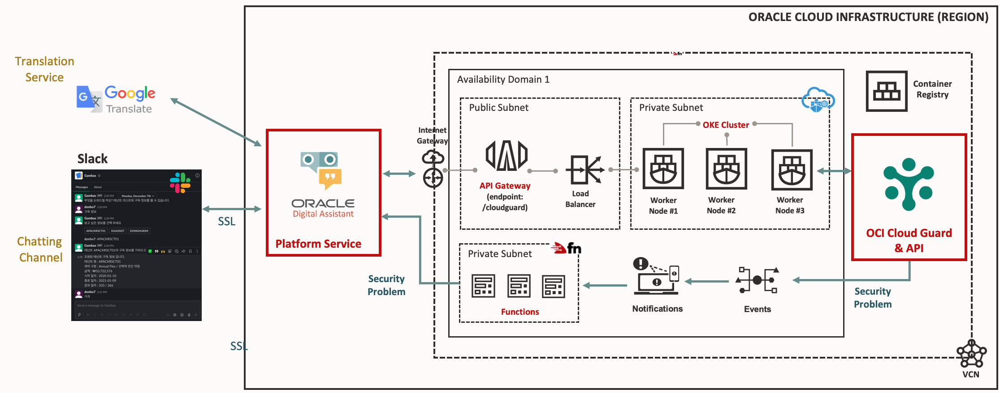
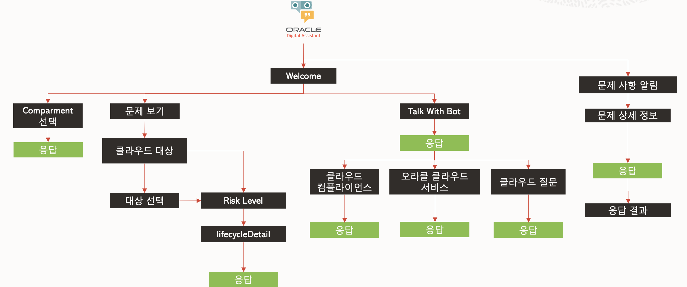

# Gambas -  Cloud Security Bot Guard
OCI의 잠재적 문제점을 가질 수 있는 클라우드 설정이 발견된 경우 모바일 등을 이용하여 담당자에게 사항을 안내하고 그에 대한 대응 방안
을 챗봇을 이요하여 진행하도록 도와 주는 서비스

***OCI Services***
* Cloud Guard
* Digital Assistant
* Oracle Kubernetes Engine
* Chatbot
* Event
* Notification

***Language***
* Containerized Program (Java: SpringBoot)
* Functions (Node.js)

***Architecture***

***Chatbot Dialog***
# gambas_v2
